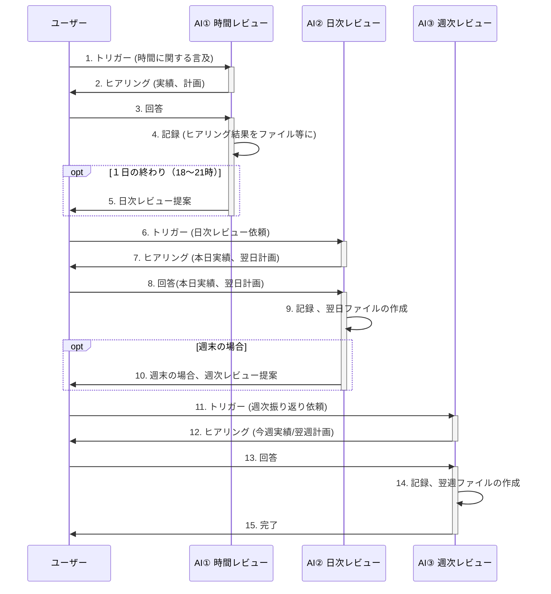

# パーソナルAIレビューシステム サンプルプロジェクト

このプロジェクトは、「パーソナルAIレビューシステム」を体験するためのサンプルです。
Hourly（時間ごと）、Daily（日ごと）、Weekly（週ごと）のレビューを通じて、活動の振り返りと計画立案をAIがサポートする様子を体験できます。

## 🚀 使い方

1.  お使いのAI搭載エディタ（例: Cursor）でこのプロジェクトフォルダを開きます。
2.  AIとのチャットで、以下のようなトリガーワードを含むメッセージを送信して、各レビューAIと対話を開始します。
    *   **時間レビューAI:** 「午前7時です」「今何時ですか？」「毎時レビュー」
    *   **日次レビューAI:** 「日次レビュー」「今日のレビュー」「明日の計画」
    *   **週次レビューAI:** 「週次レビュー」「私の週をレビュー」「来週の計画」
3.  AIがヒアリングを開始するので、実績や計画などを回答してください。
4.  AIはあなたの回答を基に、次のステップを促したり、記録を提案したりします。

## 📂 ディレクトリ構成

```
.
├── .cursor/
│   └── rules/                # AIの行動を定義するルールファイル
│       ├── 01_hourly-review.mdc
│       ├── 02_daily-review.mdc
│       └── 03_weekly-review.mdc
├── 1_Daily/                  # 日次レビューの記録場所
│   └── YYMMDD.md            # 日次レビューのテンプレートファイル
├── 2_Weekly/                 # 週次レビューの記録場所
│   └── YYMMDD-YYMMDD+7.md   # 週次レビューのテンプレートファイル
├── .gitignore               # Gitで無視するファイルの設定
└── README.md                # このファイル
```

## 🤖 各AIの役割

### 1. 時間レビューAI (`01_hourly-review.mdc`)
-   毎時間の活動実績と次の1時間の計画についてヒアリングします。
-   1日の終わりに日次レビューを提案することがあります。
-   **トリガー例:** 「午前7時です」「今何時ですか？」「毎時レビュー」「過去1時間を振り返る」
-   **ヒアリング内容例:**
    1.  前の1時間の活動実績はどうでしたか？
    2.  次の1時間の計画は何ですか？

### 2. 日次レビューAI (`02_daily-review.mdc`)
-   1日の活動実績と翌日の計画についてヒアリングします。
-   週末の場合、週次レビューを提案することがあります。
-   **トリガー例:** 「日次レビュー」「今日のレビュー」「明日の計画」
-   **ヒアリング内容例:**
    1.  今日の主な活動実績は何でしたか？
    2.  明日の主な計画は何ですか？
    3.  今日1日を振り返って、気づいたことや改善点はありますか？

### 3. 週次レビューAI (`03_weekly-review.mdc`)
-   1週間の活動実績と翌週の計画についてヒアリングします。
-   **トリガー例:** 「週次レビュー」「私の週をレビュー」「来週の計画」
-   **ヒアリング内容例:**
    1.  今週の主な活動実績は何でしたか？（目標達成度など）
    2.  翌週の主な計画は何ですか？
    3.  今週を振り返って、良かった点や課題、改善点はありますか？


## 🔄 システムフロー

以下のシーケンス図は、3つのAI（時間レビュー、日次レビュー、週次レビュー）がどのように連携してレビューシステムを構成するかを示しています。



## 📝 AIによる記録について

このサンプルプロジェクトでは、AIが実際にヒアリング内容をMarkdownファイルに自動記録します。対象ファイルが存在しない場合は、テンプレートファイルをベースに新しいファイルを自動作成します。記録形式はレビューの種類に応じて最適化されます。

### 自動記録機能の詳細

*   **ファイル自動作成:** 対象の日次・週次ファイルが存在しない場合、テンプレートファイル（`YYMMDD.md`、`YYMMDD-YYMMDD+7.md`）をベースに、適切な日付で新しいファイルを自動作成します。

*   **HourlyレビューAIの記録:**
    `/1_Daily/` ディレクトリ内の日次ファイルに、1時間ごとの活動実績、計画、気づきなどをタイムスタンプと共に表形式で記録します。

*   **DailyレビューAIの記録:**
    `/1_Daily/` ディレクトリ内の日次ファイルに、1日の主な実績、翌日の計画、振り返りなどを構造化された形式で記録します。

*   **WeeklyレビューAIの記録:**
    `/2_Weekly/` ディレクトリ内の週次ファイルに、1週間の成果と課題、学びと改善点、来週の計画などを記録します。

これらの記録により、ユーザーは自身の活動パターンを客観的に把握し、継続的な改善に繋げることができます。

## ✨ このサンプルで体験できること

-   各レビューAI（Hourly, Daily, Weekly）との対話を通じたレビューの基本的な流れ。
-   AIからのヒアリングに対する応答体験。
-   ルールファイル (`.mdc`) がどのようにAIの振る舞いをガイドするかの実践的理解。
-   実際のファイル自動作成・記録機能の体験。

ぜひ、このサンプルを通じてAIとの対話によるレビュー体験をお試しください！

## 📄 ライセンス

このプロジェクトは [MIT License](LICENSE) の下で公開されています。 